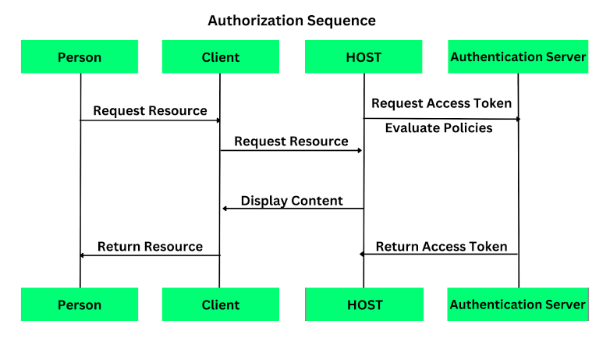

# SSO-Login

### Objective 

The project is dedicated to developing a comprehensive and secure authentication and authorization system using Keycloak as the Identity Provider (IdP), ReactJS for the frontend, Maven, Spring Boot for the backend, Spring Security for enhanced protection, Liquibase for efficient database management, Docker for containerization, Kubernetes for orchestration, and AWS for deployment. This holistic system efficiently manages critical user information, including User ID, Password, Role, and Web App Mapping, ensuring role-based access control across two distinct web applications while delivering a seamless Single Sign-On (SSO) experience.
The choice of Keycloak as the IdP, containerized within Docker, ensures a secure and scalable identity and access management system. Users access a user-friendly login page powered by Keycloak that gets the contents displayed through ReactJS, which interfaces with a Spring Boot backend. They provide their credentials, and Keycloak validates them. In case of incorrect credentials, the system displays an appropriate error message. Successful authentication rewards the user with an access token, which contains critical role and access information.
The backend, driven by Spring Boot, efficiently processes user requests, connects with the database, and manages user roles and permissions. Liquibase, a versatile database schema management tool, ensures seamless database updates, streamlining the system's evolution.
Roles are thoughtfully mapped to functionalities within the web applications, allowing diverse user experiences. The ReactJS frontend, itself a Docker container, dynamically adapts the interface based on the user's role, ensuring a personalized and secure user experience.
The project introduces Docker for containerizing both the backend and frontend components, enhancing flexibility and deployment ease. Kubernetes takes the helm for orchestration, enabling seamless scaling and management of containers, ensuring high availability and resilience. AWS serves as the deployment platform, offering a reliable, scalable, and cloud-native infrastructure.
Furthermore, the system streamlines navigation between the two web applications, enhancing user convenience and efficiency. When a user clicks a link to the second application, their access rights are validated. If authorized, they are granted access and presented with a personalized interface; otherwise, they receive a user-friendly message.
Rooted in security best practices, scalability, and regulatory compliance, this project demonstrates a commitment to an advanced authentication and authorization system. Further, the SAML is used as the identity protocol to authenticate users, and provide identity data for access control and as a communication method for a user’s identity. SAML has a long track record of providing a secure means of identity data exchange, so it is trusted by many organizations. It is also very feature-rich, covering a wide range of identity requirements. The inclusion of Liquibase ensures efficient and hassle-free database management, further bolstering the system's reliability and ease of maintenance.
By achieving these objectives, the project aims to provide a robust, secure, and highly scalable authentication and authorization system that leverages AWS for deployment and Liquibase for efficient database management. This system enhances the user experience and access control across the two web applications, all while streamlining the database schema evolution process.

### Sequence Diagram 





### Explanation Video Drive Link 
```
https://drive.google.com/file/d/1HHsYqdvTtazz-p91LNGX2cYBO3XFepXF/view?usp=sharing

```

## PREREQUISITES
- Docker
- Docker Compose Plugin

## Run the project
```
Create the .env file
Create the .env file based on the .env.sample file
docker compose up --build
docker compose up
```
